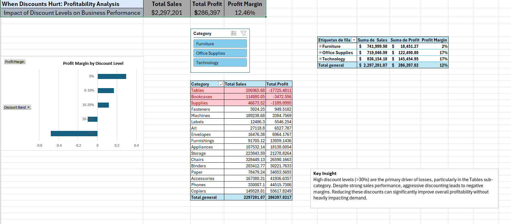

# Superstore-profitability-analysis

# When Discounts Hurt: A Profitability Analysis of Superstore

## 📊 Project Overview
This project analyzes the impact of discount levels on business profitability using the Superstore dataset.

The objective is to identify how pricing strategies affect profit margins and uncover key drivers of losses across categories and sub-categories.

---

## 🎯 Business Problem
Despite strong sales performance, the business shows inconsistent profitability.

This analysis aims to answer:
- Are discounts improving sales at the expense of profit?
- Which products are driving losses?
- Is the issue product-related or pricing-related?

---

## 📂 Dataset

The dataset used is the Superstore dataset, containing sales, profit, and discount information across multiple categories and sub-categories.

---

## 🛠️ Tools Used
- Microsoft Excel
- Pivot Tables
- Data Visualization
- Basic Data Modeling

---

## 🔍 Methodology

- Data cleaning and preparation in Excel  
- Creation of calculated fields (Profit Margin, Discount Band)  
- Aggregation using Pivot Tables  
- Data visualization and dashboard design  
- Business insight generation

---

## 📊 Key Metrics

- Total Sales  
- Total Profit  
- Profit Margin  
- Discount Percentage

---

## 📈 Key Analysis

### 1. Discount vs Profitability
- Discounts above 30% generate significant losses
- Lower discount levels maintain positive margins

### 2. Sub-Category Performance
- **Tables** is the most unprofitable sub-category
- Other sub-categories like Bookcases and Supplies also show losses

### 3. Category Insights
- Losses are present across multiple categories when high discounts are applied
- Indicates a systemic pricing issue rather than isolated product failures

---

## 💡 Key Insights

- High discount levels (>30%) are the primary driver of losses  
- Profitability is highly sensitive to discount strategies  
- Some products perform well without aggressive discounting  

---

## 📌 Recommendations

- Limit discounts to a maximum threshold (e.g., 25%)  
- Monitor profit margins by sub-category  
- Implement controlled pricing strategies  
- Reduce reliance on aggressive discounting to drive sales  

---

## ⚠️ Limitations

- Analysis is limited to available data (no cost breakdown or customer behavior data)  
- Results focus primarily on discount impact

---

## 📊 Dashboard

The dashboard provides a visual summary of:
- Profit Margin by Discount Level  
- Profit by Sub-Category  
- Overall business performance  

---

## 🚀 Key Takeaway

> Increasing sales through aggressive discounts can harm profitability.  
> A balanced pricing strategy is essential for sustainable business growth.

---

## 🧠 What I Learned

- The importance of balancing sales growth with profitability
- How pricing strategies impact business performance
- How to translate data into actionable business insights

## 📎 Author
Santiago Rincón Sánchez  
Aspiring Data Analyst
